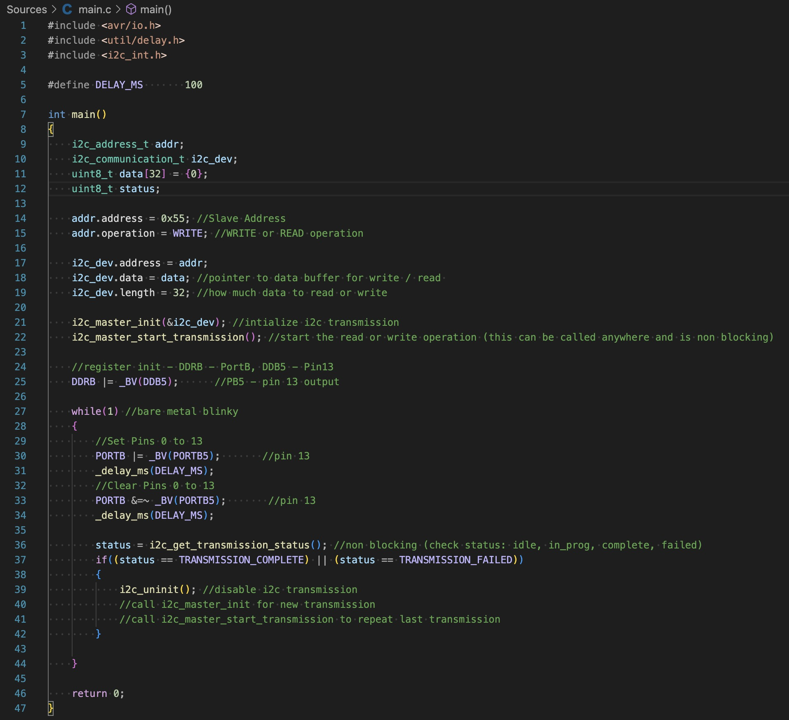

# I2C_INT Library

This repository contains a library for AVR I2C Support for Master Devices that is non-blocking.

## Build Requirements

- CMAKE Version 3.20
- avr-gcc v9 or later
- avr-binutils v2.43.1
- Linux/MacOs

### Building Library

This library has three build options:
- *[REQUIRED]*  AVR_MCU: Target MCU (Ex. atmega328p)
- *[REQUIRED]*  F_CPU: Target MCU Frequency (Ex. 16000000UL)
- *[OPTIONAL]*  CMAKE_BUILD_TYPE: [Debug | Release] (Default: Release)

To build:

    cd i2c_int
    cmake -D AVR_MCU=[Target MCU] -D F_CPU=[Target MCU Frequency] -D CMAKE_BUILD_TYPE=[Build Configuration] -S . -B lib
    cmake --build lib

## Usage

### Project Inclusion
To include this library in your project:
- Link the libi2c_int.a static library to your project
- Include the header file located at i2c_int/include

### Example

## License

This project is licensed under the MIT License. See the [LICENSE](LICENSE) file for details.

## Contributing

Contributions are welcome! Feel free to open issues or submit pull requests.